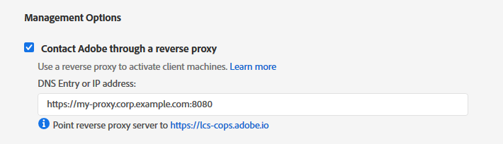

# FRL Online Proxy User Guide
{:."no_toc"}

## Table of Contents
{:."no_toc"}

* TOC Placeholder
{:toc}

# Overview

The FRL Online Proxy is a simple solution for managing feature-restricted Adobe licenses in an isolated network. It is a terminating reverse
proxy that facilitates license management for client machines that have restricted online access.

FRL-Online licenses must, at a minimum, connect to Adobe's licensing service once to activate a license, and again to deactivate the license.
This presents a challenge for networks that have limited or no access to the Internet. On isolated networks, it may be infeasible or even
impossible to facilitate access to Adobe's licensing servers.

FRL Online Proxy solves this problem by brokering requests to the licensing service on behalf of any client on the network.


## Setup Overview

1. Set up a server to run FRL Online Proxy
2. Install the proxy
3. Acquire or generate SSL certificates if needed
4. Run the proxy
5. Set up logging if desired
6. Run the proxy as a service
7. Create and deploy proxy-enabled packages

# Set up a server

FRL Online Proxy will run on any modern Windows or Linux server. This server must be part of the isolated network and be able to communicate with Adobe's licensing service (`https://lcs-cops.adobe.io`). It does not require Internet access to any other host or service.

We recommend creating a dedicated user account to run the proxy service. Note that it may be necessary to elevate this account's privileges if the proxy needs to listen on
port 443.

# Installing the Proxy

1. Download the [latest release](https://git.corp.adobe.com/dmeservices/frl-proxy/releases/latest) for the target platform.
2. Extract the release package to some root directory on the server (e.g. home directory).
3. The proxy application binary (`frl-proxy` or `frl-proxy.exe` depending on platform) and associated utilities can be found in the `frl-proxy` directory.

# Running the Proxy

The proxy service and associated tools are designed to be used from the command-line.

Open a command-line terminal on the server and switch to the `frl-proxy` directory.

```
$ cd /path/to/frl-proxy
```

Start the proxy with the `start` command.

```
# Windows
> .\frl-proxy.exe start

# Linux
$ ./frl-proxy start
```

Starting the proxy with no additional command-line or config options will use the service's default settings.

* **Host:** localhost (127.0.0.1) on port 3030
* **Remote Host (Adobe licensing server):** https://lcs-cops.adobe.io
* SSL disabled
* Log to console only at info level

## Command and usage summary

The proxy application currently supports two commands.

```
    init-config    Create a template config file
    start          Start the proxy server
```

* **init-config**: Write a template config to the current directory (see [Proxy configuration](#proxy-configuration) for more information).
* **start**: Start the service

The `start` command has some additional command-line options that govern proxy behavior.

```
    -c, --config-file <config-file>    Path to optional config file
        --host <host>                  Proxy hostname
        --remote-host <remote-host>    Remote (licensing server) hostname
        --ssl <ssl>                    Enable SSL? (true or false)
        --ssl-cert <ssl-cert>          Path to SSL certificate
        --ssl-key <ssl-key>            Path to SSL private key
```

# SSL

The proxy supports plain (non-SSL) mode for testing and debugging, but must use SSL with FRL-Online packages.

SSL mode requires an X.509 SSL certificate and RSA or pkcs8 private key. These should be placed on the server in a secure part of
the filesystem in a place where the proxy can access them.

Consult your organization's network security team if you need to use an organization certificate. Free cerftificates can be obtained
from [Let's Encrypt](https://letsencrypt.org/).

SSL can be enabled by setting the command-line option `--ssl true` and setting the paths to the private key and certificate file with
`--ssl-key` and `--ssl-cert` respectively.

Example:

```
$ ./frl-proxy --ssl true --ssl-cert /path/to/cert.pem --ssl-key /path/to/key.pem
```

This will start the proxy with SSL (https) enabled, listening on the default https host/port, `https://127.0.0.1:3030`.

**Note:** If the option `--ssl true` is in use, then the key and certificate paths must be specified. If they are specified when
The `--ssl` option is omitted or `--ssl false` is specified, then those options are ignored and the server will start in plain (http)
mode.

# Proxy configuration

FRL Online Proxy supports an optional configuration file. This config file can be used to specify any command-line option used to start
the proxy. It can also be used to control logging.

The `init-config` command will generate a template config file. By default, this file will be named `config.toml` and be placed in the current
working directory.

```
$ ./frl-proxy init-config
Created config file 'config.toml'
```

The `-o/--out-file` option overrides the default output path and filename.

```
$ ./frl-proxy init-config --out-file /path/to/my-frl-config.toml
Created config file '/path/to/my-frl-config.toml'
```

To use the configuration file when starting the proxy, pass the `-c/--config-file` option.

```
$ ./frl-proxy --config-file config.toml
or
$ ./frl-proxy -c config.toml
```

## Example configuration file

```toml
[proxy]
# Settings to invoke proxy server
host = "0.0.0.0:8080"
remote_host = "https://lcs-cops.adobe.io"
ssl = true
ssl_cert = "/path/to/ssl_cert.pem"
ssl_key = "/path/to/ssl_key.pem"

[logging]
# Logging settings
console_log_level = "debug"
log_to_file = true
file_log_level = "info"
file_log_path = "frl-proxy.log"
```

## Proxy options

The configuration options in the `[proxy]` section of the config file govern proxy behavior. Each option has an analagous command-line option.

**Note:** Each of these options are overridden by its respective command-line option. For example, if SSL is enabled in the config file and `--ssl false` is
passed in the command line, then the proxy will start in plain (http) mode.

| Option | Purpose |
|---|
| `host` | The host IP and port the proxy listens on. Format: `[host IP]:[port]`<br/>**Default:** `127.0.0.1:3030` |
| `remote_host` | Adobe Licensing Service endpoint<br/>**Default:** `https://lcs-cops.adobe.io`<br/>**Note:** This will probably never need to be overridden except to debug network communication issues |
| `ssl` | Enable (`true`) or disable (`false`) SSL.<br/>**Default:** `false` |
| `ssl_cert` | (optional) Path to SSL certificate file. Required if `ssl` is `true` and ignored otherwise |
| `ssl_key` | (optional) Path to SSL key file. Required if `ssl` is `true` and ignored otherwise |

## Logging options

Options in the `[logging]` section govern logging behavior. By default, the proxy will log to the console (`stdout`) at the `info` verbosity level. The config
can be used to change the console logging verbosity level or write log data to a file at a potentially different verbosity level.

| Option | Purpose |
|---|
| `console_log_level` | Set the verbosity level for console log output<br/>**Default:** `info` |
| `log_to_file` | Enable (`true`) or disable (`false`) file logging<br/>**Default:** `false` |
| `file_log_level` | Set the verbosity level for file log output. Ignored if `log_to_file` is `false`<br/>**Default:** `info` |
| `file_log_path` | Filename for file log output. Ignored if `log_to_file` is `false`<br/>**Default:** `frl-proxy.log` (current working directory) |

**Verbosity settings**

The log verbosity level governs the nature and amount of information that is written to the log. The proxy supports five levels, which can be set in the config
file. Log messages are prioritized based on message type - setting verbosity to a certain level will write messages at that level's priority and anything above it.
For example, setting the level to `warn` will output warnings and errors.

| Level | Priority | Purpose |
|---|:---:|---|
| `error` | 1 | Errors that impact the performance or reliability of the application |
| `warn` | 2 | Warnings that may indicate an issue, but should not impact general performance or reliability |
| `info` | 3 | Useful messages |
| `debug` | 4 | Lower-priority messages that may be useful for debugging purposes |
| `trace` | 5 | Low-level application debugging information |

# Running as a service

# Creating proxy-enabled packages

1. Log into the Admin Console - [](https://adminconsole.adobe.com)
2. Click the "Packages" tab on the top navigation bar.
3. Click the blue "Create a Package" button.
4. Select "Feature restricted licensing" and then "Next"
5. Select "Online" and then "Next"
6. Select entitlement, OS and product (app) options
7. On the next page, under "Management Options", select "Contact Adobe through a reverse proxy"

   

   Update the "DNS Entry or IP address" field to point to the FRL Online Proxy service. This can be a plain IP address or a hostname. Don't forget to
   specify the port number if using a non-standard port.


