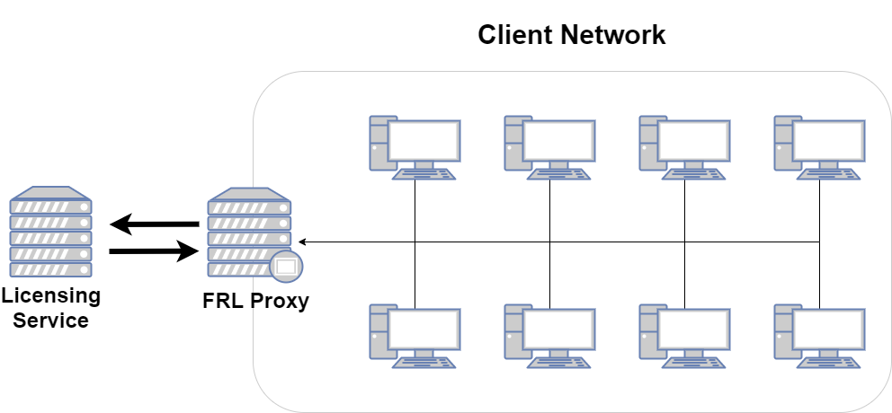
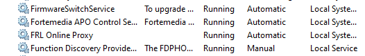
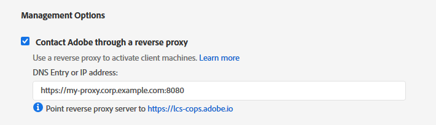

# Adobe FRL Online Proxy User Guide
{:."no_toc"}

## Table of Contents
{:."no_toc"}

* TOC Placeholder
{:toc}

# Overview

The FRL Online Proxy is a simple solution for managing feature-restricted (FRL) Adobe licenses in an isolated network. It is a caching, terminating
reverse proxy that facilitates license management for client machines that have restricted online access.

FRL-Online licenses must, at a minimum, connect to Adobe's licensing service once to activate a license, and again to deactivate the license.
This presents a challenge for networks that have limited or no access to the Internet. On isolated networks, it may be infeasible or even
impossible to facilitate access to Adobe's licensing servers.

FRL Online Proxy solves this problem by brokering requests to the licensing service on behalf of any client on the network. It also supports
caching, which lets the proxy operate when the proxy server itself may not have consistent access to Adobe licensing services.



## Use Cases

### Live Proxy

For simple use cases, the proxy can forward live calls directly to Adobe's licensing service. This mode, known as `passthrough` mode, requires
the server running the proxy have consistent live access to the licensing service.

### Cache

`cache` mode works similarly to `passthrough` except that it maintains a cache of license activation/deactivaction requests and their responses
(if the licensing service can be reached). In `cache` mode, the proxy will attempt to forward the request to the licensing service. If the
service is reachable, it will forward the response back to the FRL client. Whether or not the service is reachable, requests are cached.

Responses for cached requests can be obtained by running the proxy in `forward` mode. `cache` mode will not automatically forward cached
requests to the licensing service.

### Store and Forward

A Store and Forward setup requires two instances of the FRL Online Proxy. These instances can be set up on the same machine, different
machines on the same network, or on different networks.

* The instance running in `store` mode should be part of an isolated network where it will accept license requests from FRL-enabled applications.
* The instance running `forward` mode must have live access to Adobe's licensing service.

`store` mode is similar to `cache`, except that no live calls to Adobe's licensing service are attempted. All calls to the proxy are
automatically cached.

This mode is useful in situations where the server running the proxy cannot have live access to the Internet. If temporary access to
Adobe's licensing service can be permitted, then the proxy can run in `forward` mode to resolve license requests.

Otherwise, cache data can be exported and transferred to a different machine (via USB drive for instance), where another instance of the
proxy can resolve license requests in `forward` mode. In this case, resolved response data will need to be manually transferred back to
the machine on the isolated network and imported into the "store mode" proxy instance's database.

See [cache management](#cache-management) for more information.

`forward` mode is a special batch mode in which unresolved licensing requests are forwarded to Adobe's licensing service. If the service
is reachable then response data is stored in the cache database.

Unlike the other modes, `forward` will not launch a proxy server that listens for new requests. Once all unresolved requests are attempted
for resolution, the process will exit.

## Setup Overview

1. Set up a server to run FRL Online Proxy
2. Install the proxy
3. Acquire or generate SSL certificates if needed
4. Run the proxy
5. Set up logging if desired
6. Run the proxy as a service
7. Create and deploy proxy-enabled packages

# Set up a server

FRL Online Proxy will run on any modern Windows or Linux server. To run in `passthrough` mode, the server must be part of the isolated network and be able to communicate with Adobe's licensing service (`https://lcs-cops.adobe.io`). It does not require Internet access to any other host or service.

If the server does not have consistent (or any) access to the licensing service, the proxy should be run in `cache` or `store` mode. `cache` mode will cache all license activation and deactivation requests from FRL clients and attempt to fulfill them with the licensing service. `store` will just cache requests without attempting to contact the licensing service.

We recommend creating a dedicated user account to run the proxy service. Note that it may be necessary to elevate this account's privileges if the proxy needs to listen on
privileged ports like 80 or 443.

Regardless of the port that will be used, the system must be configured to allow traffic from any host on the desired port (e.g. `0.0.0.0:8443`).

# Installing the Proxy

### Windows

1. Download the [latest release](https://github.com/adobe/frl-online-proxy/releases/latest).
2. Open the application zip
3. Copy the `frl-proxy` directory to your desired root location
4. Open a PowerShell terminal
5. Change directory to the frl-proxy location
   ```
   > cd c:\path\to\frl-proxy
   ```
6. Run the proxy
   ```
   > .\frl-proxy.exe start
   ```

### Linux

1. Download the [latest release](https://github.com/adobe/frl-online-proxy/releases/latest). We recommend downloading it to the root of the proxy directory (e.g. `/home/[user]`)
   ```
   $ wget https://github.com/adobe/frl-online-proxy/releases/download/v0.5.1/frl-proxy-linux-0.5.1.tar.gz
   ```
2. Extract the archive
   ```
   $ tar xf frl-proxy-linux-0.5.1.tar.gz
   ```
3. The archive will extract to the directory `frl-proxy`, which contains the application binary
   ```
   $ cd frl-proxy
   $ ./frl-proxy start
   ```

# Running the Proxy

The proxy service and associated tools are designed to be used from the command-line.

Open a command-line terminal on the server and switch to the `frl-proxy` directory.

```
$ cd /path/to/frl-proxy
```

Start the proxy with the `start` command.

```
# Windows
> .\frl-proxy.exe start

# Linux
$ ./frl-proxy start
```

When you start the proxy for the first time, you will be prompted to specify a few configuration options. This
includes run mode, host IP, host ports, SSL info, caching info, etc. These settings are saved to a configuration file.
When the configuration file is present, the proxy will start without prompting for these options an additional time.

Example configuration transcript:

```
Creating initial configuration file...
The proxy has four modes: cache, store, forward, and passthrough.
Read the user guide to understand which is right for each situation.
Proxy mode: cache
The proxy uses a SQLite database to keep track of requests and responses.
The proxy will create this database if one does not already exist.
Name of (or path to) your database file: proxy-cache.sqlite
The host and port of the proxy must match the one in your license package.
Host IP to listen on: 0.0.0.0
Host port for http (non-ssl) mode: 8080
Your proxy server must contact one of two Adobe licensing servers.
Use the variable IP server unless your firewall doesn't permit it.
Adobe licensing server: Variable IP server (lcs-cops.adobe.io)
MacOS applications can only connect to the proxy via SSL.
Windows applications can use SSL, but they don't require it.
Use SSL? yes
Host port for https mode: 8443
The proxy requires a certificate store in PKCS format to use SSL.
Read the user guide to learn how to obtain and prepare this file.
Name of (or path to) your cert file: proxy-cert.pfx
Usually, for security, PKCS files are encrypted with a password.
Your proxy will require that password in order to function properly.
You have the choice of storing your password in your config file or
in the value of an environment variable (FRL_PROXY_SSL.CERT_PASSWORD).
Do you want to store a password in your configuration file? no
Do you want to customize your proxy server's logging configuration? yes
The proxy can log to the console (standard output) or to a file on disk.
Log destination: console
The proxy will log errors, warnings and summary information.
Do you want to adjust the level of logged information? yes
Read the user guide to find out more about logging levels.
Log level: debug
Wrote config file 'proxy-conf.toml'
```

Once the configuration wizard completes, configuration options are written to `proxy-conf.toml`.

Once the configuration file is created, run the same command to start the proxy.

```
# Windows
> .\frl-proxy.exe start

# Linux
$ ./frl-proxy start
```

The configuration file can be edited in any text editor. You can also use the `configure` command to initiate a walkthrough
of configuration options similar to the one presented on initial configuration.

## Command and usage summary

Proxy functionality is driven by command. The main command, `start`, is used to run the proxy according to the configuration file.

Other commands exist to help configure the proxy or manage the cache. To get a full list of supported options and commands, pass
the `-h` or `--help` option.

```
> .\frl-proxy.exe -h

frl-proxy 1.0.0
FRL Proxy

USAGE:
    frl-proxy.exe [FLAGS] [OPTIONS] <SUBCOMMAND>

FLAGS:
    -d               Specify once to force log level to debug. Specify twice to force log level to trace
    -h, --help       Prints help information
    -V, --version    Prints version information

OPTIONS:
    -c, --config-file <config-file>    Path to config file [default: proxy-conf.toml]
    -l, --log-to <log-to>              Override configured log destination: 'console' or 'file'. You can use just the
                                       first letter, so '-l c' and '-l f' work

SUBCOMMANDS:
    clear        Clear the cache (requires confirmation)
    configure    Interactively create the config file
    export       Export stored requests for a forwarder
    help         Prints this message or the help of the given subcommand(s)
    import       Import stored responses from a forwarder
    start        Start the proxy server
```

This not only documents supported commands, but shows which flags and options can be used with any command.

* `-c/--config-file` - specify config file path (default is `proxy-conf.toml`)
* `-d` - change log verbosity
* `-l/--log-to` - change log target

Any of these options must be specified before the command. For example:

```
$ ./frl-proxy -l console -c /path/to/proxy-conf.toml start
```

The `start` command provides a limited number of command-line options to override certain configuration file options.

```
    -m, --mode <mode>    Mode to run the proxy in, one of passthrough, cache, store, or forward. You can use any prefix
                         of these names (minimally p, c, s, or f)
        --ssl <ssl>      Enable SSL? (true or false)
```

These are specified after the `start` command.

```
$ ./frl-proxy start -m cache
```

# SSL

The proxy supports plain (non-SSL) mode for testing and debugging, but must use SSL with FRL-Online packages.

SSL mode requires an X.509 SSL certificate and password. The certificate file should be secured with limited file permissions
so that only the account running the proxy can read it.

The password can be stored in plain text in the configuration file or in the environment variable `FRL_PROXY_SSL.CERT_PASSWORD`.
If you store your password in the configuration, be sure to limit access to that file.

The SSL certificate must be trusted by the client machines that contact the proxy, but it need not be a publicly-signed certificate (that is, it can be a self-signed certificate that is installed on the client machines and marked as trusted). For testing, you may wish to use a free, short-lived, renewable, publicly-signed certificate obtained from [Let's Encrypt](https://letsencrypt.org/).  Consult your organization's network security team if you need to use a long-lived, publicly-signed certificate.

SSL options are configured in `proxy-conf.toml`:

```toml
[proxy]
ssl = true

[ssl]
cert_path = "proxy-cert.pfx"
cert_password = "password"
```

SSL mode can be toggled with the `--ssl` command-line option:

Example:

```
$ ./frl-proxy start --ssl false
```

# Cache, Store and Forward

The most basic mode, `passthrough`, forwards live calls to Adobe's licensing services without caching any data. It doesn't cache any
license activation or deactivation requests, and requires a live connection to the Internet at all times.

The proxy can be set up to use a local cache to store data for various use cases.

* **Requests** - Activation and deactivation requests are cached in `cache` and `store` mode. If an activation/deactivation response
  for a given request is unavailable, it can be retrieved at a later time when Internet connectivity is available.
* **Responses** - Activation and deactivation responses are cached to ensure that client packages can operate as expected when
  they get a valid cached response from the proxy.

The mode can be set in `proxy-conf.toml`:

```toml
[proxy]
mode = "cache"
```

It can also be overridden using the `-m/--mode` command-line option:

```
$ ./frl-proxy start --mode cache
```

# Cache Management

The proxy provides commands to clear, import or export the cache.

```
    clear        Clear the cache (requires confirmation)
    export       Export stored requests for a forwarder
    import       Import stored responses from a forwarder
```

## Clear

The `clear` command will clear the cache. No backup is made, so use this command with caution.

Running `clear` by itself will prompt for confirmation:

```
$ ./frl-proxy clear
Really clear the cache? This operation cannot be undone. yes
Cache has been cleared.
```

The `-y` option can be used to bypass this confirmation, in case you need to clear the cache automatically without human interaction:

```
$ ./frl-proxy clear -y
Cache has been cleared.
```

## Export

A proxy running in `store` mode can use the `export` command to export all unfulfilled license requests to a database file.

```
frl-proxy.exe-export 1.0.0
Export stored requests for a forwarder

USAGE:
    frl-proxy.exe export <export-path>

FLAGS:
    -h, --help       Prints help information
    -V, --version    Prints version information

ARGS:
    <export-path>
```

`export` takes one positional argument - the filename of the database file that will contain exported data.

Example:

```
$ ./frl-proxy export proxy-store.sqlite
Exported 24 stored request(s) to proxy-store.sqlite
```

## Import

`import` is used with a proxy that will run in `forward` mode to fulfill a batch of unfulfilled license requests. It imports request
data from a database file that was generated using `export`.

```
frl-proxy.exe-import 1.0.0
Import stored responses from a forwarder

USAGE:
    frl-proxy.exe import <import-path>

FLAGS:
    -h, --help       Prints help information
    -V, --version    Prints version information

ARGS:
    <import-path>
```

The positional argument specifies that path of a data file to import.

```
$ ./frl-proxy import proxy-store.sqlite
Imported 24 forwarded request/response pair(s) from proxy-store.sqlite
```

# Working with an Upstream Proxy

The FRL Online Proxy can be configured to use an upstream proxy in order to communicate with Adobe's licensing service. It can be used
with no authentication or with basic authentication. It can be configured using the interactive configuration wizard (with `./frl-proxy configure`)
or manually [in the config file](#network-options).

# Proxy Configuration

The configuration file is named `proxy-conf.toml` by default. It uses [TOML](https://toml.io/) syntax.

Running `start` for the first time will start a configuration wizard that will prompt you to set up the configuration file.
The configuration file can be updated at any time by using the `configure` command.

Example:

```toml
[proxy]
mode = "cache"
host = "0.0.0.0"
port = "8080"
ssl_port = "8443"
remote_host = "https://lcs-cops.adobe.io"
ssl = true

[ssl]
cert_path = "proxy-cert.pfx"
cert_password = ""

[logging]
level = "debug"
destination = "console"
file_path = "proxy-log.log"

[cache]
db_path = "proxy-cache.sqlite"

[network]
use_proxy = false
proxy_host = "127.0.0.1"
proxy_port = "8888"
use_basic_auth = false
proxy_username = ""
proxy_password = ""
```

## Proxy Options

The configuration options in the `[proxy]` section of the config file govern proxy behavior.

| Option | Purpose |
|---|---|
| `mode` | Mode of operation - `passthrough`, `cache`, `store`, or `forward`<br/>Overridden with `-m/--mode` |
| `host` | The host IP the proxy listens on |
| `port` | The host port the proxy listens on in http (non-SSL) mode |
| `ssl_port` | The host port the proxy listens on in https (SSL) mode |
| `remote_host` | Adobe Licensing Service endpoint |
| `ssl` | Enable (`true`) or disable (`false`) SSL<br/>Overridden with `-ssl` |

## SSL Options

The configuration options in the `[ssl]` section of the config file specify SSL certificate options

| Option | Purpose |
|---|---|
| `cert_path` | Path to SSL certificate file. Required if `ssl` is `true` and ignored otherwise |
| `cert_password` | SSL certificate password. IF not specified, then the environment variable `FRL_PROXY_SSL.CERT_PASSWORD` is checked |

## Logging Options

Options in the `[logging]` section govern logging behavior. By default, the proxy will log to the console (`stdout`) at the `info` verbosity level. The config
can be used to change the console logging verbosity level or write log data to a file at a potentially different verbosity level.

| Option | Purpose |
|---|---|
| `level` | Set the verbosity level for log output<br/>`-d` overrides this and sets level to `debug`<br/>`-dd` will set level to `trace` |
| `destination` | Log to `console` or `file`<br/>Overridden with `-l/--log-to` |
| `file_path` | Filename for file log output. Ignored if `destination` is `console` |

**Verbosity settings**

The log verbosity level governs the nature and amount of information that is written to the log. The proxy supports five levels, which can be set in the config
file. Log messages are prioritized based on message type - setting verbosity to a certain level will write messages at that level's priority and anything above it.
For example, setting the level to `warn` will output warnings and errors.

| Level | Priority | Purpose |
|---|:---:|---|
| `error` | 1 | Errors that impact the performance or reliability of the application |
| `warn` | 2 | Warnings that may indicate an issue, but should not impact general performance or reliability |
| `info` | 3 | Useful messages |
| `debug` | 4 | Lower-priority messages that may be useful for debugging purposes |
| `trace` | 5 | Low-level application debugging information |

## Cache Options

`[cache]` specifies cache options

| Option | Purpose |
|---|---|
| `db_path` | Path to cache DB |

## Network Options

`[network]` configures upstream proxy options.

| Option | Purpose |
|---|---|
| `use_proxy` | Enable upstream proxy connection |
| `proxy_host` | Hostname or IP address of upstream proxy |
| `proxy_port` | Port to use for upstream proxy connection |
| `use_basic_auth` | Enable basic authentication? |
| `proxy_username` | Username for basic authentication |
| `proxy_password` | Password for basic authentication |

# Running as a service

To ensure the highest level of availability and reliability, the proxy should be run as a service. This ensures that the proxy is always running. If
the service is interrupted for any reason (such as system reboot), it will automatically restart.

There are different methods for installing and enabling the proxy as a service depending on the environment.

## Windows

Windows realeases of FRL Online Proxy include tools for setting up the service. The script `bin\service.ps1` provides a simple interface for
managing the proxy as a service.

Example:

```
> .\service.ps1 start
Service "FRL Online Proxy" installed successfully!
FRL Online Proxy: START: The operation completed successfully.
```

Notes:

* Windows Powershell is required to run `service.ps1`
* Administrator rights are required to install the service, so run `service.ps1` from a Powershell Admin console.
* `service.ps1` must be run from the `frl-proxy` working directory
* A config file is required with the filename `proxy-conf.toml`. This file must be in the same working directory as `frl-proxy.exe` and `service.ps1`.
  See [Proxy configuration](#proxy-configuration) for more information.

Commands:

| Command | Purpose |
|---|---|
| `start` | Install and start the proxy as a service. |
| `stop` | Stop the proxy service |
| `restart` | Restart the proxy service |
| `remove` | Stop the service if necessary and remove from the registry |

When the service is installed and running, you can view the status of the service in Windows Service Manager.

1. Open the run dialog - `Windows Key + R`
2. Enter the command `services.msc`
3. Press Enter
4. The Service Manager will open showing a list of services installed on the system
5. Ensure that FRL Online Proxy is installed, running and has a Startup Type of "Automatic"
   

If something doesn't work as expected, see [Getting help](#getting-help).

## Linux

On Linux systems, the easiest way to set up a service for the proxy is [systemd](https://systemd.io/).

**Note:** `sudo` privileges are required for many of these steps. We recommend creating or designating a
non-privileged user account that will run the proxy and own the configuration and log files.

1. Download the latest release to the desired system.
2. Extract the `frl-proxy` binary to a system binary directory such as `/usr/bin`
3. Generate a config file (see [Proxy configuration](#proxy-configuration))
4. Open the config file in a text editor and configure proxy and logging settings (host, ssl settings)
   * If the proxy will be run by a non-privileged account, it is necessary to set the proxy to listen on a port
     number higher than 1024 (e.g. 4343)
   * The config file should be copied to a system data directory (we recommend `/etc/frl-proxy`)
   * The log file should be written to a system log directory such as `/var/log` (we recommend `/var/log/frl-proxy`)
5. If you are going to run the proxy as a non-privileged user, change ownership of config file and log directory.
   Replace `[user]` and `[group]` with the user and group of the non-privileged account.
   * `sudo chown [user]:[group] /etc/frl-proxy/proxy-conf.toml`
   * `sudo chown -R [user]:[group] /var/log/frl-proxy`
6. Create the service configuration file `/etc/systemd/system/frl-proxy.service` and open it in a text editor
7. Copy this example configuration to the editor. Be sure to change the paths to the proxy binary and config file if necessary.
   And replace `[user]` with the name of the account that will run the proxy.

   ```
   [Unit]
   Description=FRL Online Proxy
   After=network.target
   StartLimitIntervalSec=0

   [Service]
   Type=simple
   Restart=always
   RestartSec=1
   User=[user]
   ExecStart=/usr/bin/frl-proxy -c /etc/frl-proxy/proxy-conf.toml start

   [Install]
   WantedBy=multi-user.target
   ```

With the service config in place, the service can be controlled with `systemctl`. Here are some examples of how to manage the service.

```sh
# Enable/disable determines if the service will start on boot
sudo systemctl enable frl-proxy
sudo systemctl disable frl-proxy

# Start/stop will manually start and stop the service, restart will stop and then start it
sudo systemctl start frl-proxy
sudo systemctl stop frl-proxy
sudo systemctl restart frl-proxy

# If any changes are made to the frl-proxy.service config, the systemd daemon must be reloaded
sudo systemctl daemon-reload
```

If something doesn't work as expected, see [Getting help](#getting-help).

# Creating proxy-enabled packages

FRL-Online packages must be configured to use the proxy. Proxy settings are managed in the Adobe Admin Console.

1. Log into the [Admin Console](https://adminconsole.adobe.com)
2. Click the "Packages" tab on the top navigation bar.
3. Click the blue "Create a Package" button.
4. Select "Feature restricted licensing" and then "Next"
5. Select "Online" and then "Next"
6. Select entitlement, OS and product (app) options
7. On the next page, under "Management Options", select "Contact Adobe through a reverse proxy"

   

   Update the "DNS Entry or IP address" field to point to the FRL Online Proxy service. This can be a plain IP address or a hostname. Don't forget to
   specify the port number if using a non-standard port.

# Getting help

All bug requests, feature requests, questions and feedback submissions are handled with Github issues. Please create a new
[issue](https://github.com/adobe/frl-online-proxy/issues) if you need any assisance or support.
